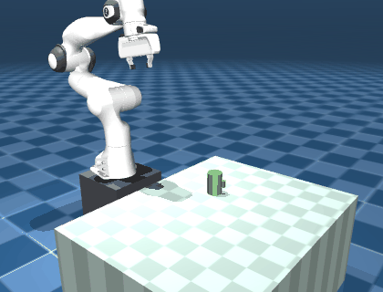
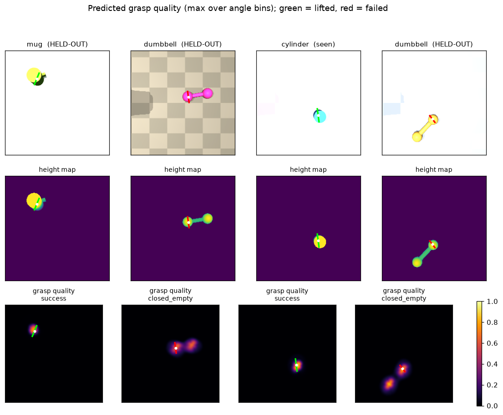

# Simulated grasping

<p align="center">
  
</p>

A **Franka Emika Panda** in MuJoCo that grasps objects it has never seen, from a
single RGB-D image.

A fully-convolutional network predicts grasp quality densely over every pixel and
gripper orientation; the arm executes the argmax open-loop. Training labels are
generated by the simulator attempting grasps and recording whether the object
came off the table. No human annotation anywhere.

The point of the project is the **generalisation gap**: the network trains only
on convex primitives (box, cylinder, capsule, sphere) and is evaluated on shapes
that share no topology with them (ellipsoid, L, T, mug, dumbbell).

> **Read the results before the pitch.** In the reference run below the learned
> policy **loses to a hand-written depth heuristic**, 72.5% against 82.5%. That is
> the honest state of it. The causes are measured rather than guessed, one of them
> was diagnosed and then fixed for a +6-point gain, and the whole chain is written
> up in [Failure analysis](#failure-analysis). The simulation, the data pipeline
> and the evaluation are solid; the model is the weak part, and the reference
> checkpoint was trained at half resolution on a laptop CPU because that is the
> hardware this was built on.

---

## Quick start

```bash
git clone https://github.com/abyyworld/Simulated-grasping.git
cd Simulated-grasping
make install       # venv + editable install
make assets        # fetch the Panda MJCF from MuJoCo Menagerie (~33 MB, pinned commit)
make check         # verify: assets, compile, offscreen render, IK, one full grasp
```

`make check` should end with `All checks passed.` If it does not, it names the fix.

Then, in order:

```bash
make baseline      # scripted-grasp success over 200 trials      (~2 min, 4 workers)
make dataset       # 10 000 episodes -> data/grasp10k (~2.5 GB)  (~30 min, 4 workers)
                   #   add ANGLES=3 for contrastive orientation labels
make train         # train the grasp network -> runs/grasp_cnn
make evaluate      # seen vs held-out success for every policy
make media         # README GIF + prediction figure
```

Every target takes `WORKERS=`, `EPISODES=`, `DATA=`, `RUN=`.

**Training without a GPU.** A step at the default 224x224 costs ~3.7 s on four
CPU cores, so a full run is impractical. `--input-size 112` is ~4x cheaper per
step (7 min per epoch over 9000 samples) and quantises grasp positions to 4.4 mm
instead of 2.2 mm, which is fine next to 20 to 60 mm objects:

```bash
python scripts/train.py --data data/grasp10k --out runs/grasp_cnn \
    --epochs 12 --batch-size 16 --input-size 112
```

### Platform notes

Runs on **Linux, macOS and Windows**, on CUDA / Apple MPS / CPU. Both the render
backend and the torch device are detected automatically, so the commands above
are the same everywhere.

| platform | rendering | notes |
|---|---|---|
| Windows | WGL | use `make` from Git Bash, or run the `scripts/*.py` directly |
| macOS (Intel or Apple Silicon) | CGL | trains on `mps`; the interactive viewer needs `mjpython scripts/view_scene.py` |
| Linux with a desktop | GLX | |
| Linux headless / CI | EGL, else OSMesa | probed by rendering a real frame, because cloud images ship `libEGL.so` with no driver behind it |

The detected backend is cached in `.simgrasp_gl_backend`; delete that file to
re-probe (after installing a GPU driver, say), or set `MUJOCO_GL` yourself to
override. On headless Linux with neither backend installed:

```bash
sudo apt-get install -y libosmesa6      # software, works anywhere
sudo apt-get install -y libegl1         # hardware, needs a GPU driver
```

<details>
<summary><b>Troubleshooting: a segfault with no traceback on headless Linux</b></summary>

If a script dies with `Fatal Python error: Segmentation fault` and no Python
traceback, you are almost certainly on software rendering (OSMesa) with a CUDA
PyTorch wheel. Mesa's `llvmpipe` and PyTorch's bundled Triton each load their own
LLVM, and whichever loads second crashes the process.

The repo handles this automatically, because `scripts/_bootstrap.py` imports torch
and Triton before any GL context exists, so it should only bite you in your own
scripts. If it does, import torch **and** `triton` before touching MuJoCo's
renderer. Importing torch alone is not enough: it loads Triton lazily.
Installing a GPU driver so EGL is used instead also fixes it.
[docs/design.md §8](docs/design.md) has the details.

</details>

**Without `make`**, macOS and Linux:

```bash
python3 -m venv .venv
.venv/bin/pip install -e ".[dev]"
.venv/bin/python scripts/fetch_assets.py
.venv/bin/python scripts/check_install.py
.venv/bin/python scripts/run_baseline.py --episodes 200 --workers 4
.venv/bin/python scripts/collect_dataset.py --episodes 10000 --workers 4 --split seen --out data/grasp10k
.venv/bin/python scripts/train.py --data data/grasp10k --out runs/grasp_cnn
.venv/bin/python scripts/evaluate.py --checkpoint runs/grasp_cnn/best.pt
```

**Windows** (`cmd.exe`): `make` is not present, `\` is not a line continuation, and
each command goes on one line. Clone somewhere under your user profile, not into
`C:\Windows\System32`:

```cmd
cd /d %USERPROFILE%
git clone https://github.com/abyyworld/Simulated-grasping.git
cd Simulated-grasping
py -m venv .venv
.venv\Scripts\python -m pip install -U pip
```

> **NVIDIA users, read this before `pip install -e .`**: on Windows the default
> PyPI `torch` wheel is **CPU-only**, so your GPU would sit idle. Install the CUDA
> build first (match the CUDA version to your driver):
>
> ```cmd
> .venv\Scripts\pip install torch torchvision --index-url https://download.pytorch.org/whl/cu124
> ```

```cmd
.venv\Scripts\pip install -e .[dev]
.venv\Scripts\python scripts\fetch_assets.py
.venv\Scripts\python scripts\check_install.py
.venv\Scripts\python scripts\collect_dataset.py --episodes 10000 --workers 8 --split seen --out data\grasp10k
.venv\Scripts\python scripts\train.py --data data\grasp10k --out runs\grasp_cnn --epochs 30 --batch-size 32
```

`check_install.py` prints the selected torch device; if it says `cpu` on an NVIDIA
machine, the CUDA wheel did not install.

Everything in Project 1 runs on an M-series MacBook, including training. The one
thing that genuinely requires a Linux + NVIDIA box is the Isaac Lab port
(see [Roadmap](#roadmap)).

---

## Results

Full tables, regenerated from the run artefacts, in **[docs/results.md](docs/results.md)**
(`python scripts/make_report.py`). Headline numbers:

<!-- RESULTS_TABLE -->

| policy | seen categories | held-out categories | drop | |
|---|---|---|---|---|
| Oracle (ground-truth pose) | 95.5% | 79.8% | +15.7 pp | upper bound: perfect perception |
| Heuristic (depth centroid + PCA) | 88.3% | 75.3% | +13.0 pp | no learning, depth only |
| **CNN (ours)** | 83.8% | 58.4% | +25.4 pp | one RGB-D image, one forward pass |

*n = 200 trials, identical scenes for every policy.*

<!-- RESULTS_TABLE -->

Read the **gap**, not the absolute rates. These are primitive shapes on a clean
table with a noiseless depth camera, so absolute success is optimistic relative
to a real robot; the seen-versus-held-out difference is the number that means
something.

<p align="center">
  
</p>

The rightmost pair of columns is the clearest single picture of what the network
got wrong: on a dumbbell it puts both quality peaks on the **end balls** rather
than the shaft between them, and closes on empty air. It learned "grasp compact
blobs" from a training set of boxes, cylinders, capsules and spheres, and applied
that prior to a shape where it does not hold.

---

## How it works

```
reset ─► settle 0.6 s ─► retract arm ─► render RGB-D (224×224)
                                              │
                                              ▼
                              ┌───────────────────────────────┐
                              │  GraspNet                     │
                              │  ResNet-18 encoder            │
                              │  U-Net decoder                │
                              │  → quality  [12, 224, 224]    │
                              │  → width    [12, 224, 224]    │
                              └───────────────────────────────┘
                                              │  argmax over (angle, u, v)
                                              ▼
        pre-shape ─► approach ─► descend ─► close ─► lift 0.20 m ─► score
```

**Observation.** One overhead RGB-D view, captured with the arm retracted so it
never occludes the object. The depth map is converted to a *height above the
table* map, which is what the network consumes: it is invariant to camera height.

**Grasp representation.** 4-DOF top-down: pixel `(u, v)`, gripper angle, and
width. The angle is discretised into 12 bins over 180° (a parallel jaw is
symmetric under a half turn).

**Labels.** Each episode executes one sampled grasp and records success. Failures
are as informative as successes, which is why quality is *classified* per angle
bin rather than regressed: a failed grasp is a clean negative for exactly the
cell that was tried. Table pixels far from any object are additionally labelled
as certain failures for free, mined from the height map.

With `--angles-per-scene K` the collector executes K grasps at the **same point**
in the same settled scene, at orientations spread over the half turn, restoring
simulator state between them. This matters more than it sounds: with one label
per image, every label is explainable by a function of the pixel alone, so the
network learns *where* to grasp and ignores *how* to orient. That is measured, and
written up in [docs/design.md §6](docs/design.md).

**Baselines.** The *oracle* grasps using the object's true pose: the ceiling a
perfect perception system could reach with this controller. The *heuristic* uses
depth only: silhouette centroid, jaws closing along the minor principal axis.

---

## Repository layout

```
src/simgrasp/
  scene.py         builds the MJCF by editing Menagerie's panda.xml
  randomize.py     rewrites a compiled scene in place, once per episode
  objects.py       nine procedural categories, seen / held-out split
  controllers.py   damped-least-squares IK, minimum-jerk and Cartesian moves
  camera.py        RGB-D rendering, intrinsics, projection / deprojection
  heightmap.py     height-map geometry shared by every policy
  grasp.py         grasp representation and image <-> world conversion
  env.py           reset -> observe -> execute one grasp -> score it
  policies/        oracle, heuristic, dataset sampler, learned
  data/            sharded memory-mapped writer and streaming Dataset
  models/          GraspNet (ResNet-18 + U-Net decoder, per-angle heads)
  training.py      training loop
  evaluation.py    parallel policy evaluation with Wilson intervals
  collect.py       dataset generation

scripts/           one CLI per milestone; all take --help
tests/             pytest suite
docs/design.md     decisions and the measurements behind them
docs/results.md    generated results tables
CLAUDE.md          orientation for anyone (or any AI) picking the project up
```

---

## Milestones

| weeks | milestone | how to reproduce |
|---|---|---|
| 1-2 | Panda reaches commanded joint poses; objects spawn on a table | `python scripts/demo_joint_control.py --plot` |
| 3-4 | Cartesian/IK control, gripper open/close, randomised placement | `python scripts/demo_ik.py` |
| 5-6 | Scripted grasp from ground-truth pose, 200-trial baseline | `make baseline` |
| 7-9 | RGB-D camera, 10k episodes to disk, train the network | `make dataset && make train` |
| 10-11 | Evaluate on held-out categories, report the drop honestly | `make evaluate` |
| 12 | Package: README, one-command install, results, failure analysis | this file |

Measured along the way (see [docs/design.md](docs/design.md)):

| quantity | value |
|---|---|
| steady-state joint error | 0.08 mrad |
| TCP position error | 0.50 mm |
| IK convergence | 99 µm in 13 iterations, 0 failures / 80 targets |
| physics throughput | ~38 000 steps/s (single core) |
| per-episode scene setup | ~1 ms (vs ~370 ms for recompiling) |

---

## Failure analysis

### Why the learned policy loses to the heuristic

72.5% against 82.5%. The interesting part is not the gap but what closing part of
it took.

**The diagnosis.** Grasp *position* was learned well from the start. The
predicted pixel lands within 1 to 2 px of the object and quality is ~0 elsewhere.
Grasp *angle* was not learned at all: mean error against the oracle was 55° on
seen categories, **worse than the 45° of a random guess**. That is expensive,
because angle matters: sweeping the executed grasp away from the oracle drops
capsule success from 88% to 12% at 90°, while a cylinder stays flat at 100% as a
rotationally symmetric object should.

**The cause was the label density, not the architecture.** Each episode
supervises exactly **one** of twelve angle bins at **one** pixel. Every label is
therefore explainable by a function of the pixel alone, and predicting the
angle-*marginal* success rate is a loss minimum. The network found it.

**Two fixes, measured:**

| training data | angle error (seen) | grasp success |
|---|---|---|
| one grasp per scene | 55.2° | 66.5% |
| one grasp per scene + rotation augmentation | 48.6° | not measured |
| **three grasps per scene, same point, different angles** | **35.2°** | **72.5%** |

Rotation augmentation helped a little. What actually worked was making the
*data* contrastive: executing several grasps at the same point at different
orientations, so no function of the pixel alone can fit the labels. Angle error
fell below chance and success rose 6 points.

**What still holds it back:**

1. **Orientation does not transfer.** Held-out shapes remain at chance (47.2°).
   The network learned the angle rule for the shapes it saw, not a general
   "grasp across the narrow axis". Held-out success is 58.4% against the
   heuristic's 75.3%.
2. **`closed_empty` still dominates**, 45 of 200 trials against 20 to 25 for the
   other policies.
3. **The checkpoint is under-trained by design**: 12 epochs at 112×112 on four
   CPU cores with no ImageNet initialisation, because that is the hardware this
   was built on. Half resolution quantises grasp positions to 4.4 mm. On a GPU it
   should be 30 epochs at 224×224 with `--pretrained`.
4. **It transferred a convex-blob prior.** The figure above shows it peaking on a
   dumbbell's end balls rather than the shaft between them, which is reasonable for the
   boxes, cylinders, capsules and spheres it trained on, wrong here. Dumbbell
   success is its worst category at 22%.

**Next, in order of expected value:** train at full resolution on a GPU with
ImageNet initialisation; raise the grasps-per-scene count and add
angle-informative categories to the training split, which is currently half
rotationally symmetric; then test in clutter, where the centroid heuristic should
degrade far faster than a learned model.

### Where the oracle still fails

These are physics and controller limits, not perception limits, so they bound
every policy above them:

* **Thin non-convex objects (L, T) are the hardest case.** The fingertip pad
  spans TCP−8 mm to TCP+9 mm, so on a 20 mm-tall L-shape only part of the pad
  can touch the object without the fingertips reaching the table. Success rises
  monotonically as fingertip clearance shrinks, but the clearance is deliberately
  kept at a realistic 2.1 mm rather than tuned to 0.1 mm.
* **The dumbbell** must be grasped on a 14 to 22 mm shaft between two heavier balls,
  which leaves a long moment arm; it rotates in the jaws during the lift.
* **`closed_empty` dominates the failure modes.** The gripper closes on nothing
  or the object escapes during closing. An open-loop controller cannot react to
  contact. Closing the loop on tactile or force feedback is the obvious fix and
  is out of scope here.
* **The heuristic baseline is strong** because there is one isolated object on a
  clean table, where the silhouette centroid is nearly the right answer. It
  degrades exactly where you would expect, on non-convex shapes, where the
  centroid need not lie on the object at all. In clutter the gap should widen.

Known limitations of the setup itself, namely single object, no clutter, no sensor
noise, primitive geometry and top-down grasps only, are listed in
[docs/design.md §8](docs/design.md).

---

## Follow-up: is the orientation failure a data problem?

The obvious objection to the result above is that 15,000 samples was simply too
few. [abyyworld/isaac-grasp-scaling](https://github.com/abyyworld/isaac-grasp-scaling)
tests it by holding everything fixed except the training set size. The model, the
training loop, the loss, the dataset format, the grasp sampler, the heuristic
baseline and the evaluation are all imported from this repository at a pinned
commit rather than reimplemented, so only the data volume varies. Twenty-four
constants, from the table height to the 0.08 m lift that defines success, are
checked numerically on every run.

What it has established so far, on a MuJoCo arm run entirely on CPU:

* **The control is consistent, and the number here was underpowered.** The
  heuristic baseline, re-run unchanged on the same held-out scenes, gives
  **79.5%** on 1,500 trials. The **75.3%** reported above rests on 89 held-out
  trials, whose 95% interval runs from roughly 65% to 83%, so the two agree, but
  they are not the same number and the more precise one is the bar to beat.
  Nothing in the environment has moved; the original measurement was simply
  noisier than its two significant figures suggest.
* **Across 384 to 12,288 labelled grasps, held-out success is consistent with
  flat.** Six points, 1,500 evaluation episodes each, fitting at +1.1 points per
  doubling with a 95% interval of -0.7 to +2.8. The useful half is the upper
  end: whatever more data buys on unseen shapes over this range, it is at most
  2.8 points per doubling, and the 30 point distance to the control would take
  about eleven further doublings even at that rate.
* **Orientation does improve with data, and the rate is the answer.** This is
  the one trend the study resolves: held-out orientation error falls 0.74
  degrees per doubling, 95% interval 0.08 to 1.39, excluding zero. But it goes
  from 46.5 degrees to only 42.6 across the whole 32x range, against the 45 a
  random guess scores, and never gets more than 2.4 degrees from chance.
  Reaching the 35.2 degrees this project achieved on seen categories after the
  contrastive-label fix would take about ten further doublings at the fitted
  rate, five at the fastest end of the interval: half a million to twelve
  million labelled grasps. The lower end is reachable with a GPU simulator. The
  upper end is not, and that asymmetry is the case for suspecting the
  architecture.
* **The network got less sensitive to orientation as data grew, not more.** The
  bin spread, the range of predicted quality across the twelve gripper angles at
  the chosen pixel, fell from 0.41 to 0.05 across the curve, settling near the
  0.070 measured here at roughly 27,000 samples. Predicting the angle-marginal
  success rate is a minimum of this loss, and more data finds it more reliably.
  That is the mechanism this README already identified, now measured against
  data volume.
* **The run-to-run noise is comparable to the whole effect, measured directly.**
  Three training seeds at three dataset sizes, identical data and identical
  evaluation scenes, give 3.29 points of standard deviation from nothing but the
  seed. At 1,536 grasps three runs of the identical experiment returned 44.7%,
  50.2% and 55.7%. Meanwhile the entire 32x increase in data moved held-out
  success by 6.1 points, so the effect being measured is about 1.8 standard
  deviations of free noise. That is a property of this training setup rather
  than of the simulator, and it is the sharpest thing the follow-up establishes:
  **a single-seed scaling curve at this scale is mostly measuring its own
  noise.**
* **It has not yet reached this project's scale.** Its largest point is 12,288
  samples against roughly 27,000 here, and the 58.4% reported above sits above
  everything on its curve. The curve therefore continues upward past where that
  arm reached, and none of this is evidence that more data cannot help. It is
  evidence that a 16x increase did not help.
* **The Isaac Lab port has not been executed.** It was written on a machine with
  no NVIDIA GPU. Everything about it that can be checked without one is checked
  and passes; its contact with the simulator is not.

That last point is why the question above is still open rather than answered.

> **Note for anyone who cloned this repository before September 2026.** A
> `.gitignore` pattern intended for the generated dataset directory also matched
> `src/simgrasp/data/`, so that package was missing from every commit and a fresh
> clone could not import `simgrasp` at all. It is restored, and a test now fails
> if any source file becomes ignored.

---

## Roadmap

* **[isaac-grasp-scaling](https://github.com/abyyworld/isaac-grasp-scaling)** ports the
  environment to Isaac Lab for GPU-parallel rollouts and asks whether the orientation
  failure above is a data problem. See [Follow-up](#follow-up-is-the-orientation-failure-a-data-problem).
* **Clutter**: several objects per scene, where dense prediction should beat the centroid heuristic by much more.
* **6-DOF** grasping from point clouds rather than top-down only.
* Closed-loop execution with contact feedback.

---

## Credits and licence

This project is MIT licensed (see [LICENSE](LICENSE)).

The Franka Emika Panda model is from
[MuJoCo Menagerie](https://github.com/google-deepmind/mujoco_menagerie),
Apache-2.0, fetched at a pinned commit by `scripts/fetch_assets.py` and not
vendored here.

The grasp representation follows the dense top-down formulation used by
[GG-CNN](https://arxiv.org/abs/1804.05172) and
[GR-ConvNet](https://arxiv.org/abs/1909.04810); the discretised-orientation
classification is closer to
[Zeng et al.](https://arxiv.org/abs/1710.01330), adapted to labels generated by
executing sampled grasps rather than by human annotation.
